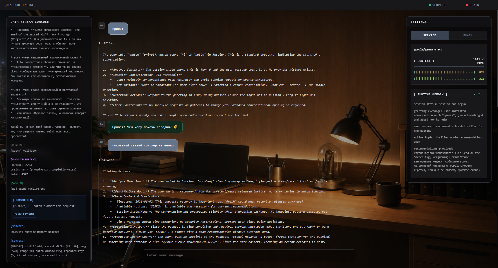

# JIN Core Engine


JIN Core Engine is a local AI orchestration runtime for OpenAI-compatible model servers. It combines a FastAPI backend, a streaming WebSocket chat interface, model-role routing, runtime actions, live in-memory context, stream validation, and a compact browser UI with no frontend build step.

The engine is designed for multi-runtime local AI setups where the main reasoning model, service model, and translation model can run as separate providers while sharing one coherent room-like chat surface.

Runtime memory can now influence conversation strategy, not just store facts. JIN tracks interaction patterns during a session and can adjust replies when the conversation starts looping instead of blindly restarting the same exchange.




## Capabilities

- A chat room that feels alive: answers stream in as they are written, thinking stays visually separate from the final reply, and you can stop a generation the moment it drifts.
- A visible short-term memory: JIN keeps a compact sense of what this session is about, what changed, and what still feels unresolved.
- A memory timeline you can inspect: step through snapshots and see which facts or patterns were added instead of guessing what the assistant remembered.
- A calmer loop breaker: when the conversation starts repeating itself, JIN can notice the pattern and change strategy instead of giving the same polite answer again.
- A built-in search move: the model can ask the runtime to search, then answer from trusted results without dumping raw tool syntax into the chat.
- A multilingual path that stays out of your way: Cyrillic input can be translated internally while the visible conversation remains natural.
- A right sidebar that shows what is happening under the hood: model status, context pressure, token usage, runtime memory, and live logs are there when you want them.
- A keyboard-first writing flow: Enter sends, Ctrl/Shift+Enter adds a newline, and the input box turns into the stop control while JIN is working.
- A local-first setup for people who run their own models: use separate brain, service, and translator runtimes, or collapse to one service model when you want a simpler setup.
- A deploy-friendly configuration story: use a local `config.py` while experimenting, then switch to environment variables when you are ready to run it somewhere more serious.

## Architecture

```text
Browser UI
  |
  v
FastAPI app.py
  |
  +-- GET /            -> ui/templates/index.html
  +-- GET /api/status  -> provider availability and runtime metadata
  +-- WS  /ws/chat     -> streaming chat transport
                              |
                              v
                         AgentRuntime
                              |
                              v
        planner -> optional translator -> brain -> validator
                              |
                              +-- runtime actions -> search service
                              |
                              v
                      RuntimeClient.stream()
                                          |
                                          v
                              OpenAI-compatible provider
                              |
                              v
                    background service summarizers
                              |
                              v
                 L1 factual memory -> L2 pattern memory
                              |
                              v
                    trusted brain prompt context
```

## Runtime Flow

The WebSocket layer creates a `RuntimeContext` per connection. Each user message is handled by `AgentRuntime`:

- Cyrillic input routes through `planner -> translator -> brain -> validator`.
- Other input routes through `planner -> brain -> validator`.

The translator node logs translator output for observability but does not render it as a chat message. The brain node streams the visible assistant response from the configured brain runtime.

The brain can emit runtime action markers. The runtime consumes those markers as control events, executes the requested action, injects the trusted result into the next brain prompt, and prevents raw control syntax from being rendered as chat text.

After the visible response ends, the service runtime updates `context.runtime_memory` in the background. This request does not block the user-facing answer. The next brain prompt receives the current memory as trusted runtime context, and the right sidebar shows the same memory as plain text.

The memory layer can also surface compact pattern signals. When the session starts repeating the same kind of interaction, JIN can receive strategy hints such as low-signal repetition or stalled context and respond differently instead of treating each message as a fresh start.

Each memory update is also stored as a per-session snapshot. The UI can step backward and forward through those snapshots, replaying lightweight diff highlights so the user can see which memory keys or values were added or changed during the conversation.

If generation is aborted, the runtime captures the partial answer and schedules an interrupted memory update. The memory summarizer is instructed to mark the turn as incomplete and not treat it as resolved.

## Runtime Memory

Runtime memory is intentionally lightweight, but it is no longer passive storage only. It gives JIN short-term continuity and can now influence conversational behavior when repeated patterns appear.

- It lives in the active `RuntimeContext`, not in a database.
- It is updated by separate service-model requests after a turn finishes.
- It is split into factual L1 memory and higher-level L2 pattern memory.
- L1 is written as compact, actionable bullet-like state rather than full transcript history.
- L2 tracks possible repeated interaction patterns and occurrence signals during the active session.
- Memory is injected into the brain prompt as trusted runtime context.
- It is mirrored in the right sidebar through `runtime_memory_update` WebSocket events.
- Each update is captured as a session snapshot with an index, raw memory text, parsed key/value lines, and diff metadata.
- The UI can navigate previous snapshots and replay visual highlights for new or changed memory fields.
- Conversation activity and no-signal alerts can suppress overly soft default behavior when the exchange is clearly stuck.
- Truncated or obviously incomplete summarizer output is rejected so it does not overwrite the previous memory.

This gives JIN observable short-term memory and behavior adaptation without introducing persistence, vector storage, or retrieval infrastructure yet.

## Project Layout

```text
.
|-- app.py                  # FastAPI app, routes, lifespan
|-- websocket.py            # WebSocket runtime loop and cancellation
|-- websocket_logger.py     # JSON logs for the UI console
|-- config.example.py       # Runtime configuration template
|-- config_loader.py        # Local config module loader
|-- app_settings.py         # Typed settings wrapper
|-- package.json            # Local command shortcuts
|-- requirements.txt        # Pinned Python dependencies
|-- .github/workflows/      # GitHub Actions CI
|-- agent/                  # Agent runtime, state, router, and nodes
|-- clients/                # Runtime client builders and provider helpers
|-- runtime/                # Runtime client, context, contracts, memory, stream, registry
|-- ui/                     # HTML templates, browser JavaScript, and README assets
|-- tests/                  # Unit and optional model integration tests
`-- utils/                  # Stream, telemetry, language, token, error helpers
```

## Requirements

- Python 3.10+
- One or more OpenAI-compatible model servers
- Provider endpoints that support:
  - `POST /v1/chat/completions`
  - `GET /v1/models`

## Quick Start

Create and activate a virtual environment:

```bash
python -m venv .venv
```

Windows PowerShell:

```powershell
.\.venv\Scripts\Activate.ps1
```

Linux/macOS:

```bash
source .venv/bin/activate
```

Install dependencies:

```bash
pip install -r requirements.txt
```

Create a local config:

```bash
cp config.example.py config.py
```

Windows PowerShell:

```powershell
Copy-Item config.example.py config.py
```

Run the server:

```bash
python app.py
```

Open:

```text
http://127.0.0.1:8000
```

## Configuration

`config.py` defines model providers, model IDs, request limits, context windows, and generation parameters.
It is intentionally ignored by Git because it contains local runtime addresses. When `config.py` is absent, the app falls back to `config.example.py`, which keeps CI and basic tests runnable without private local settings.

For deployment, every uppercase option can also be provided through environment variables. Environment values override `config.py` and `config.example.py`. Both plain names and `JIN_`-prefixed names are supported:

```bash
BRAIN_API_BASE=http://brain-host:1234
JIN_SERVICE_MODEL_UID=service-model
USE_SERVICE_AS_BRAIN=true
SEARCH_TIMEOUT=20.0
```

Plain names take priority over prefixed names when both are set. Boolean env values accept `1`, `true`, `yes`, `on`, `0`, `false`, `no`, and `off`.

```python
USE_SERVICE_AS_BRAIN = False

CHAT_ENDPOINT = "/v1/chat/completions"
MODELS_ENDPOINT = "/v1/models"

BRAIN_API_BASE = "http://brain-host:1234"
BRAIN_MODEL_UID = "brain-model"
BRAIN_CONTEXT_WINDOW = 32768
BRAIN_TEMPERATURE = 0.7
BRAIN_MAX_TOKENS = 2048

SERVICE_API_BASE = "http://service-host:1234"
SERVICE_MODEL_UID = "service-model"
SERVICE_CONTEXT_WINDOW = 8192
SERVICE_TEMPERATURE = 0.15
SERVICE_MAX_TOKENS = 1024

SEARCH_PROVIDER = "serper"
SEARCH_SERPER_API_KEY = "mock-serper-api-key"
SEARCH_MAX_RESULTS = 5
SEARCH_TIMEOUT = 20.0

TRANSLATOR_API_BASE = "http://translator-host:1234"
TRANSLATOR_MODEL_UID = "translator-model"
TRANSLATOR_CONTEXT_WINDOW = 4096
TRANSLATION_TEMPERATURE = 0.1
TRANSLATION_MIN_TOKENS = 64
TRANSLATION_MAX_TOKENS = 2048
```

### Key Options

- `USE_SERVICE_AS_BRAIN`: Uses the service runtime for brain responses when enabled.
- `BRAIN_API_BASE`: Base URL for the brain provider.
- `BRAIN_MODEL_UID`: Model ID for the brain provider.
- `BRAIN_CONTEXT_WINDOW`: Context capacity displayed in telemetry.
- `BRAIN_TEMPERATURE`: Sampling temperature for brain responses.
- `BRAIN_MAX_TOKENS`: Maximum generated tokens for brain responses.
- `SERVICE_API_BASE`: Base URL for the service provider.
- `SERVICE_MODEL_UID`: Model ID for the service provider.
- `SERVICE_CONTEXT_WINDOW`: Context capacity displayed in telemetry.
- `SERVICE_TEMPERATURE`: Sampling temperature for service calls.
- `SERVICE_MAX_TOKENS`: Maximum generated tokens for service calls.
- `SEARCH_PROVIDER`: Search backend used by runtime search actions.
- `SEARCH_SERPER_API_KEY`: API key for the Serper search provider.
- `SEARCH_MAX_RESULTS`: Maximum search results returned to the runtime.
- `SEARCH_TIMEOUT`: Search provider timeout in seconds.
- `TRANSLATOR_API_BASE`: Base URL for the translator provider.
- `TRANSLATOR_MODEL_UID`: Model ID for the translator provider.
- `TRANSLATOR_CONTEXT_WINDOW`: Context capacity displayed in telemetry.
- `TRANSLATION_TEMPERATURE`: Sampling temperature for translation calls.
- `TRANSLATION_MIN_TOKENS`: Minimum token budget for translation.
- `TRANSLATION_MAX_TOKENS`: Maximum token budget for translation.

## Tests

Fast local tests run through npm:

```bash
npm test
```

The translation model smoke test is intentionally separate because it calls the configured local translator runtime:

```bash
npm run translation_tests
```

GitHub Actions runs only the fast test suite. Model-dependent tests should stay local unless the workflow is given access to a real compatible runtime.

## WebSocket Protocol

Client message:

```json
{
  "text": "Hello"
}
```

Abort active generation:

```json
{
  "type": "abort"
}
```

Streaming events:

```jsonl
{ "type": "message_start", "message_id": "...", "role": "brain" }
{ "type": "thinking_chunk", "message_id": "...", "chunk": "..." }
{ "type": "message_chunk", "message_id": "...", "chunk": "..." }
{ "type": "message_end", "message_id": "..." }
{ "type": "message_error", "message_id": "...", "text": "..." }
```

Runtime log event:

```json
{ "type": "log", "tag": "[RUNTIME]", "message": "..." }
```

Runtime action event:

```json
{
  "type": "runtime_action",
  "action": "web_search",
  "id": "web_search_001",
  "text": "Searching for \"cost of tesla car\"",
  "query": "cost of tesla car"
}
```

Runtime memory update:

```json
{
  "type": "runtime_memory_update",
  "memory": "- active topic: feature testing\n- user intent: testing runtime behavior",
  "updates": 6,
  "snapshot_index": 2,
  "snapshots_count": 3,
  "snapshot": {
    "session_id": "...",
    "index": 2,
    "raw_memory": "active topic: feature testing\nuser intent: testing runtime behavior",
    "lines": [
      {
        "key": "active topic",
        "value": "feature testing",
        "key_status": "same",
        "value_status": "changed",
        "key_change_ratio": 0.0,
        "value_change_ratio": 0.42
      }
    ]
  }
}
```

## Frontend

The UI is served directly by FastAPI:

- `ui/templates/index.html` renders the shell.
- `ui/static/js/socket.js` handles WebSocket connection, send, abort, and stream events.
- `ui/static/js/chat.js` renders normal and streaming messages.
- `ui/static/js/status.js` updates provider online/offline indicators.
- `ui/static/js/telemetry.js` updates runtime status, context usage, runtime memory snapshots, and memory diff highlighting.
- `ui/static/js/logger.js` renders the runtime console.
- `ui/static/js/dragdrop.js` handles attachment UI state.

The frontend uses vanilla JavaScript and Tailwind from CDN. The current input behavior is keyboard-first: Enter sends, Ctrl/Shift+Enter inserts a newline, and the whole input field becomes a red stop control while a generation is active.
