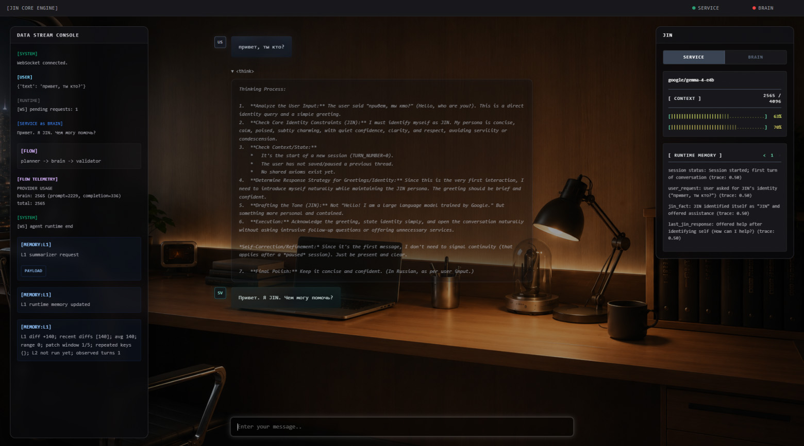
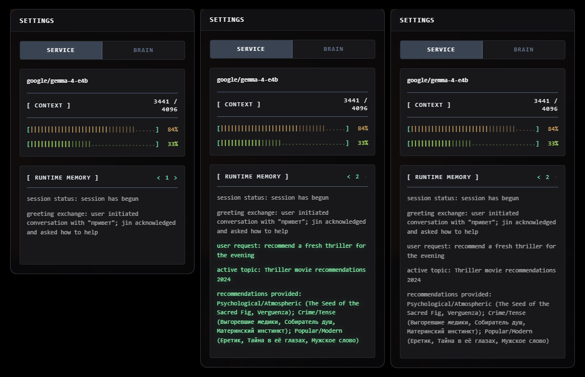
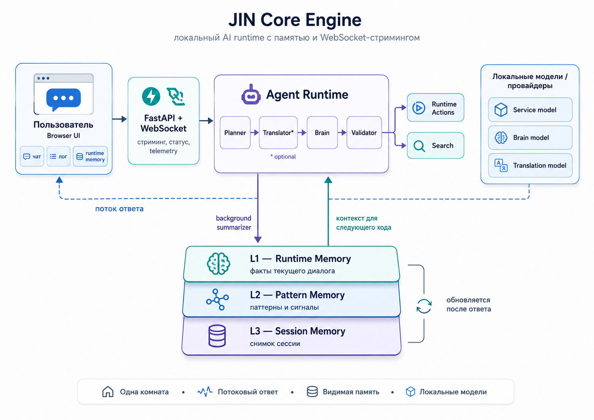

# JIN Core Engine


**JIN Core** is a local-first AI orchestration runtime. Instead of treating models as simple stateless chat boxes, it splits them into dedicated runtime roles (reasoning, service, translation) inside a single, seamless browser interface — with no frontend build step required.

### 3-Layer Memory
JIN doesn't just store logs. It uses short-term continuity to dynamically guide conversation strategy:

* **L1 (Live Facts):** Actionable session state kept in active process memory.
* **L2 (Patterns):** Tracks interaction loops and repetition counters to adapt prompts on the fly.
* **L3 (Digest):** Compressed session snapshots serialized to browser `localStorage` and replayed on reconnect.

*Every memory update is captured as a versioned snapshot with diff highlights, fully inspectable in the right-side timeline panel.*






## Capabilities

- A chat room that feels alive: answers stream in as they are written, thinking stays visually separate from the final reply, and you can stop a generation the moment it drifts.
- A visible short-term memory: JIN keeps a compact sense of what this session is about, what changed, and what still feels unresolved.
- A memory timeline you can inspect: step through snapshots and see which facts or patterns were added instead of guessing what the assistant remembered.
- A calmer loop breaker: when the conversation starts repeating itself, JIN can notice the pattern and change strategy instead of giving the same polite answer again.
- A built-in search move: the model can ask the runtime to search, then answer from trusted results without dumping raw tool syntax into the chat.
- A session save and restore path: saying something like "save the session" or "that's all for today" triggers a compact L3 memory digest. The browser stores it locally and replays it on reconnect so the next session starts from context rather than blank slate.
- A philosophy reasoning mode: questions touching consciousness, meaning, subjectivity, or qualia activate a stricter set of reasoning rules that resist premature structure and push for causal coherence.
- A multilingual path that stays out of your way: Cyrillic input can be translated internally while the visible conversation remains natural.
- A file and image attachment surface: files and images can be dragged into the chat column or selected via the attachment button and queued before sending.
- A right sidebar that shows what is happening under the hood: model status, context pressure, token usage, runtime memory, and live logs are there when you want them.
- A keyboard-first writing flow: Enter sends, Ctrl/Shift+Enter adds a newline, and the input box turns into the stop control while JIN is working.
- A local-first setup for people who run their own models: use separate brain, service, and translator runtimes, or collapse to one service model when you want a simpler setup.
- A deploy-friendly configuration story: use a local `config.py` while experimenting, then switch to environment variables when you are ready to run it somewhere more serious.

## Architecture



## Runtime Flow

The WebSocket layer creates a `RuntimeContext` per connection. Each user message is handled by `AgentRuntime`:

- Cyrillic input routes through `planner -> translator -> brain -> validator`.
- Other input routes through `planner -> brain -> validator`.

The translator node logs translator output for observability but does not render it as a chat message. The brain node streams the visible assistant response from the configured brain runtime.

The brain can emit runtime action markers. The runtime consumes those markers as control events, executes the requested action, injects the trusted result into the next brain prompt, and prevents raw control syntax from being rendered as chat text.

After the visible response ends, the service runtime updates `context.runtime_memory` in the background. This request does not block the user-facing answer. The next brain prompt receives the current memory as trusted runtime context, and the right sidebar shows the same memory as plain text.

The memory layer can also surface compact pattern signals. When the session starts repeating the same kind of interaction, JIN can receive strategy hints such as low-signal repetition or stalled context and respond differently instead of treating each message as a fresh start.

Each memory update is also stored as a per-session snapshot. The UI can step backward and forward through those snapshots, replaying lightweight diff highlights so the user can see which memory keys or values were added or changed during the conversation.

If generation is aborted, the runtime captures the partial answer and schedules an interrupted memory update. The memory summarizer is instructed to mark the turn as incomplete and not treat it as resolved.

When the user signals the end of a session — explicitly or through natural closing phrases — the brain emits a `REMEMBER_SESSION` action. The runtime builds a compact L3 digest from the current snapshot history and sends it to the browser for local storage. On the next connection, the browser sends the digest back as part of the bootstrap payload and the runtime injects it as trusted session context before the first turn.

Certain topics activate a stricter reasoning mode automatically. Questions about consciousness, subjectivity, qualia, or meaning cause the brain prompt to include a philosophy rule block that resists premature categorization, demands causal coherence in scene reasoning, and treats obvious answers as the first thing worth questioning.

## Runtime Memory

Runtime memory is intentionally lightweight, but it is no longer passive storage only. It gives JIN short-term continuity and can now influence conversational behavior when repeated patterns appear.

- It lives in the active `RuntimeContext`, not in a database.
- It is updated by separate service-model requests after a turn finishes.
- It is split into factual L1 memory, higher-level L2 pattern memory, and a long-horizon L3 session digest.
- L1 is written as compact, actionable bullet-like state rather than full transcript history.
- L2 tracks possible repeated interaction patterns and occurrence signals during the active session.
- L3 is a compressed session summary generated at explicit save points and stored in the browser. It survives page reloads and reconnects.
- Memory is injected into the brain prompt as trusted runtime context.
- It is mirrored in the right sidebar through `runtime_memory_update` and `runtime_session_memory_update` WebSocket events.
- Each L1/L2 update is captured as a session snapshot with an index, raw memory text, parsed key/value lines, and diff metadata.
- The UI can navigate previous snapshots and replay visual highlights for new or changed memory fields.
- Conversation activity and no-signal alerts can suppress overly soft default behavior when the exchange is clearly stuck.
- Truncated or obviously incomplete summarizer output is rejected so it does not overwrite the previous memory.

This gives JIN observable short-term memory and behavior adaptation without introducing persistence, vector storage, or retrieval infrastructure yet.


## Memory Snapshot Examples

JIN memory is stored as plain `key: value` lines so it can be shown in the UI, injected into prompts, diffed between turns, and compressed into a later session digest. The keys are semantic handles rather than a fixed database schema, but the current runtime expects stable line shapes for important contracts and pattern evidence.

### L1 memory snapshot (facts)

L1 is the live factual layer. It keeps the current state needed for the next answer: user request, active topic, latest user message, unresolved contracts, stored recall values, and the latest response gist. It is not a transcript and it should not infer long-term personality traits.

```text
session status: Session shifted from an ASCII art request to a poetry/haiku side task while a recall contract remains open.
user_message: "у тебя хорошо получается"
current request: Acknowledge the compliment while preserving the active recall contract.
active topic: Word Recall Test (Secret word).
stored_memory: "Небо" (purpose: secret word for future recall test; status: pending)
countdown_contract: Recall the secret word "Небо"; created_at: 2026-06-13T18:31:57.142147; created_user_message_count: 1; count_from: 1; count_to: 4; due_user_message_count: 4; current: 5; remaining: 0; status: due; trigger: Ask the user to recall the secret word directly.
last_jin_response: Acknowledged the compliment and prompted the user to recall the stored word without revealing it.
```

A rendered runtime snapshot also carries metadata used by the right-side timeline panel:

```json
{
  "session_id": "runtime-session-id",
  "index": 5,
  "raw_memory": "session status: ...\nuser_message: ...",
  "lines": [
    {
      "key": "stored_memory",
      "value": "\"Небо\" (purpose: secret word for future recall test; status: pending)",
      "key_status": "same",
      "value_status": "same",
      "key_change_ratio": 0.0,
      "value_change_ratio": 0.0
    }
  ],
  "patch": {
    "stored_memory": {
      "status": "same",
      "value": "\"Небо\" (purpose: secret word for future recall test; status: pending)"
    }
  },
  "total_diff": 87.3
}
```

The UI may show temporary trace strength such as `(trace: 0.50)` or inject `user_idle: 9s` into the displayed context. Those are runtime metadata signals, not durable memory facts.

### L2 memory snapshot (patterns)

L2 works above L1. It watches recent L1 patch windows for repeated interaction patterns, loops, and same-intent behavior. It should describe hypotheses with occurrence counters and scope, not turn them into permanent user traits.

```text
possible pattern: Repeated identical user message during loop testing. Occurrences: 4; first_seen_snapshot: 2; last_seen_snapshot: 5; evidence summary: User sent the same short message several times in the same probe window; confidence: high.
L2_pattern_evidence_1: user repeatedly sending one message [ quote: "ping" ] [ first_seen_turn_snapshot: 2 ] [ last_seen_turn_snapshot: 5 ] [ occurrences: 4 ]
likely_intent: User may be stress-testing whether JIN detects low-signal repetition before changing response strategy.
scope: Current session/test sequence, not a stable user preference.
```

`L2_pattern_evidence_N` is a runtime accounting line. The quote must come from an actual L1 `user_message` value, the occurrence count is based on matching snapshot evidence, and L1 must not rewrite the line. If the latest turn resolves or cancels an L2 evidence item, L1 writes a separate status companion instead:

```text
L2_pattern_evidence_1_status: status: resolved; reason: identified as a test
```

### L3 memory snapshot (session)

L3 is the session handoff layer. It is generated at save/restore points from selected L1 snapshots, L2 pattern context, recent diff history, and optional session event snapshots. It keeps what should survive a reload or a new tab: project direction, durable facts, decisions, unresolved tasks, constraints, and next step.

```text
session_status: Runtime stabilization pass completed after the first public JIN Core release cycle.
project_focus: Clean runtime memory architecture and behavior-probe reliability.
durable_fact: JIN uses L1 factual memory, L2 pattern memory, and L3 session digest memory with visible snapshots and diff metadata.
decision: Keep public commit titles calm and place implementation details inside commit bodies and release notes.
completed_work: Extracted L3 session memory into a dedicated layer; split memory rules into L1/L2/L3 boundaries; cleaned compatibility exports.
behavior_probe_result: ASCII drawing fallback, movie recommendation closure, and delayed recall-word contract stayed green after the refactor.
next_step: Publish v0.6-runtime-stabilization and continue L1/L2 cleanup.
```

For rare moments that need richer sequence memory, L3 can preserve an episodic key moment:

```text
memory_type: episodic_key_moment
title: Recall-word probe felt like a personal JIN moment
emotional_weight: medium
why_it_matters: Demonstrated that JIN can return to a shared contract at a natural conversational moment, not only as a mechanical timer.
sequence:
1. User asked JIN to choose a secret word and ask for it later.
2. The conversation moved through ASCII drawing and haiku side tasks.
3. JIN prompted the user to recall the secret word without revealing it.
preserve_detail: The callback mattered because it felt like continuity inside the conversation, not a raw reminder.
```

## Project Layout

```text
.
|-- app.py                  # FastAPI app, routes, lifespan
|-- websocket.py            # WebSocket runtime loop and cancellation
|-- websocket_logger.py     # JSON logs for the UI console
|-- config.example.py       # Runtime configuration template
|-- config_loader.py        # Local config module loader
|-- app_settings.py         # Typed settings wrapper
|-- launch_jin.bat          # Windows one-click launcher
|-- launch_jin.ps1          # LM Studio readiness check and startup script
|-- package.json            # Local command shortcuts
|-- requirements.txt        # Pinned Python dependencies
|-- saved_runtime.example.txt  # Template for persisted L3 session memory
|-- .github/workflows/      # GitHub Actions CI
|-- agent/                  # Agent runtime, state, router, and nodes
|-- clients/                # Runtime client builders and provider helpers
|-- runtime/                # Runtime client, context, contracts, memory, stream, registry
|-- rules/                  # Brain prompt rule blocks: identity, loop, philosophy, vision, runtime actions
|-- ui/                     # HTML templates, browser JavaScript, and README assets
|-- tests/                  # Unit and optional model integration tests
`-- utils/                  # Stream, telemetry, language, token, error helpers
```

## Requirements

- Python 3.10+
- One or more OpenAI-compatible model servers
- Provider endpoints that support:
  - `POST /v1/chat/completions`
  - `GET /v1/models`

## Windows One-Click Launcher

Windows users can start JIN with LM Studio through:

```text
launch_jin.bat
```

The launcher uses LM Studio as the default provider. When `config.py` already exists, it checks configured provider base URLs first, in this order: `SERVICE_API_BASE`, `BRAIN_API_BASE`, then `TRANSLATOR_API_BASE`. If no configured provider responds, it falls back to the default OpenAI-compatible API at:

```text
http://localhost:1234/v1/models
```

Before running it:

- Install and open LM Studio.
- Download a supported Gemma model in LM Studio. Recommended default: `google/gemma-3-12b-it`.
- Start the LM Studio Local Server.

The launcher does not download models automatically. LM Studio downloads are intentionally left to the LM Studio UI.

When the Local Server is reachable, the launcher reads and prints the returned model IDs, then checks local `config.py`.

For `BRAIN_MODEL_UID`, `SERVICE_MODEL_UID`, and `TRANSLATOR_MODEL_UID`, the launcher only writes a Gemma model automatically when the current value is empty or still uses the template defaults: `brain-model`, `service-model`, or `translator-model`. If a user-defined model ID is already present, the launcher keeps it unchanged.

For provider base URLs, the launcher points empty/template values at the working LM Studio base URL it found, but keeps user-defined values unchanged.

If LM Studio is not running, it prints:

```text
LM Studio is not running.
Open LM Studio, start Local Server, then run this script again.
```

If no supported Gemma model is returned, it prints the recommended model ID and asks you to download it in LM Studio, then rerun the launcher.

After the readiness check passes, the launcher creates `.venv` if needed, installs `requirements.txt`, starts the backend, and opens:

```text
http://127.0.0.1:8000
```

If the launcher is already running, a second click exits immediately instead of repeating the LM Studio, config, dependency, and backend checks.

## Quick Start

Create and activate a virtual environment:

```bash
python -m venv .venv
```

Windows PowerShell:

```powershell
.\.venv\Scripts\Activate.ps1
```

Linux/macOS:

```bash
source .venv/bin/activate
```

Install dependencies:

```bash
pip install -r requirements.txt
```

Create a local config:

```bash
cp config.example.py config.py
```

Windows PowerShell:

```powershell
Copy-Item config.example.py config.py
```

Run the server:

```bash
python app.py
```

Open:

```text
http://127.0.0.1:8000
```

## Configuration

`config.py` defines model providers, model IDs, request limits, context windows, and generation parameters.
It is intentionally ignored by Git because it contains local runtime addresses. When `config.py` is absent, the app falls back to `config.example.py`, which keeps CI and basic tests runnable without private local settings.

For deployment, every uppercase option can also be provided through environment variables. Environment values override `config.py` and `config.example.py`. Both plain names and `JIN_`-prefixed names are supported:

```bash
BRAIN_API_BASE=http://brain-host:1234
JIN_SERVICE_MODEL_UID=service-model
USE_SERVICE_AS_BRAIN=true
SEARCH_TIMEOUT=20.0
```

Plain names take priority over prefixed names when both are set. Boolean env values accept `1`, `true`, `yes`, `on`, `0`, `false`, `no`, and `off`.

```python
USE_SERVICE_AS_BRAIN = False

CHAT_ENDPOINT = "/v1/chat/completions"
MODELS_ENDPOINT = "/v1/models"
NATIVE_MODELS_ENDPOINT = "/api/v0/models"

BRAIN_API_BASE = "http://brain-host:1234"
BRAIN_MODEL_UID = "brain-model"
BRAIN_CONTEXT_WINDOW = 32768
BRAIN_TEMPERATURE = 0.7
BRAIN_MAX_TOKENS = 2048

SERVICE_API_BASE = "http://service-host:1234"
SERVICE_MODEL_UID = "service-model"
SERVICE_CONTEXT_WINDOW = 8192
SERVICE_TEMPERATURE = 0.15
SERVICE_MAX_TOKENS = 1024

RUNTIME_OUTPUT_TOKEN_RESERVE = 512
RUNTIME_CONTEXT_WINDOW_FALLBACK_TO_SERVER = True
RUNTIME_MAX_TOKENS_FALLBACK_TO_SERVER = True

SEARCH_PROVIDER = "serper"
SEARCH_SERPER_API_KEY = "mock-serper-api-key"
SEARCH_MAX_RESULTS = 5
SEARCH_TIMEOUT = 20.0

TRANSLATOR_API_BASE = "http://translator-host:1234"
TRANSLATOR_MODEL_UID = "translator-model"
TRANSLATOR_CONTEXT_WINDOW = 4096
TRANSLATION_TEMPERATURE = 0.1
TRANSLATION_MIN_TOKENS = 64
TRANSLATION_MAX_TOKENS = 2048
```

### Key Options

- `USE_SERVICE_AS_BRAIN`: Uses the service runtime for brain responses when enabled.
- `NATIVE_MODELS_ENDPOINT`: Optional provider-native metadata endpoint. LM Studio exposes the currently loaded context length here, which is more accurate than some `/v1/models` responses. Leave empty to disable native probing.
- `BRAIN_API_BASE`: Base URL for the brain provider.
- `BRAIN_MODEL_UID`: Model ID for the brain provider.
- `BRAIN_CONTEXT_WINDOW`: Context capacity displayed in telemetry.
- `BRAIN_TEMPERATURE`: Sampling temperature for brain responses.
- `BRAIN_MAX_TOKENS`: Maximum generated tokens for brain responses.
- `SERVICE_API_BASE`: Base URL for the service provider.
- `SERVICE_MODEL_UID`: Model ID for the service provider.
- `SERVICE_CONTEXT_WINDOW`: Context capacity displayed in telemetry.
- `SERVICE_TEMPERATURE`: Sampling temperature for service calls.
- `SERVICE_MAX_TOKENS`: Maximum generated tokens for service calls.
- `RUNTIME_OUTPUT_TOKEN_RESERVE`: Reserved context headroom kept free when calculating the dynamic response budget. Prevents requests from filling the context window exactly. Defaults to `512`.
- `RUNTIME_CONTEXT_WINDOW_FALLBACK_TO_SERVER`: When `true`, JIN prefers the loaded context length reported by the runtime server over local config values. Defaults to `true`.
- `RUNTIME_MAX_TOKENS_FALLBACK_TO_SERVER`: When `true`, JIN prefers the server-reported output token limit for model calls. Defaults to `true`.
- `SEARCH_PROVIDER`: Search backend used by runtime search actions.
- `SEARCH_SERPER_API_KEY`: API key for the Serper search provider.
- `SEARCH_MAX_RESULTS`: Maximum search results returned to the runtime.
- `SEARCH_TIMEOUT`: Search provider timeout in seconds.
- `TRANSLATOR_API_BASE`: Base URL for the translator provider.
- `TRANSLATOR_MODEL_UID`: Model ID for the translator provider.
- `TRANSLATOR_CONTEXT_WINDOW`: Context capacity displayed in telemetry.
- `TRANSLATION_TEMPERATURE`: Sampling temperature for translation calls.
- `TRANSLATION_MIN_TOKENS`: Minimum token budget for translation.
- `TRANSLATION_MAX_TOKENS`: Maximum token budget for translation.

## Session Memory Persistence

L3 session memory lets context survive across browser sessions without a server-side database.

To save a session, say something that signals you are done: "save the session", "that's all for today", "wrap it up", "I'm going to sleep", or the Russian equivalents. The brain emits a `REMEMBER_SESSION` action and the runtime builds a compressed digest from the current snapshot history. The browser stores this digest in `localStorage` and also writes it back to `saved_runtime.txt` if that path is configured.

On the next page load or reconnect, the browser includes the saved digest in its bootstrap payload. The runtime receives it, validates it against any fresh L1 memory that may have accumulated, and injects the session context into the brain prompt before the first turn.

The sidebar shows a distinct indicator when a session was restored from a saved digest rather than built from live L1 memory.

`saved_runtime.example.txt` shows the expected format for a pre-populated session memory file. Copy it to `saved_runtime.txt` and edit the contents to seed JIN with static facts that should survive every session.

Important events — a major decision, a strong insight, a correction that changes how JIN understands the user — can also be saved mid-session with a `REMEMBER_EVENT` action. The brain emits this automatically when the conversation reaches a clear milestone.

## Tests

Fast local tests run through npm:

```bash
npm test
```

The translation model smoke test is intentionally separate because it calls the configured local translator runtime:

```bash
npm run translation_tests
```

GitHub Actions runs only the fast test suite. Model-dependent tests should stay local unless the workflow is given access to a real compatible runtime.

## WebSocket Protocol

Client message:

```json
{
  "text": "Hello"
}
```

Abort active generation:

```json
{
  "type": "abort"
}
```

Streaming events:

```jsonl
{ "type": "message_start", "message_id": "...", "role": "brain" }
{ "type": "thinking_chunk", "message_id": "...", "chunk": "..." }
{ "type": "message_chunk", "message_id": "...", "chunk": "..." }
{ "type": "message_end", "message_id": "..." }
{ "type": "message_error", "message_id": "...", "text": "..." }
```

Runtime log event:

```json
{ "type": "log", "tag": "[RUNTIME]", "message": "..." }
```

Runtime action event:

```json
{
  "type": "runtime_action",
  "action": "web_search",
  "id": "web_search_001",
  "text": "Searching for \"cost of tesla car\"",
  "query": "cost of tesla car"
}
```

Runtime memory update:

```json
{
  "type": "runtime_memory_update",
  "memory": "- active topic: feature testing\n- user intent: testing runtime behavior",
  "updates": 6,
  "snapshot_index": 2,
  "snapshots_count": 3,
  "snapshot": {
    "session_id": "...",
    "index": 2,
    "raw_memory": "active topic: feature testing\nuser intent: testing runtime behavior",
    "lines": [
      {
        "key": "active topic",
        "value": "feature testing",
        "key_status": "same",
        "value_status": "changed",
        "key_change_ratio": 0.0,
        "value_change_ratio": 0.42
      }
    ]
  }
}
```

Runtime L1 diff update (incremental key-level change history):

```json
{
  "type": "runtime_l1_diff_update",
  "diffs": [...],
  "stats": { "total_changes": 4, "keys_added": 1, "keys_changed": 3 },
  "strength_map": { "active topic": 0.8 },
  "strength_zones": { "high": ["active topic"], "low": [] }
}
```

Session memory update (L3 digest, sent after save or restore):

```json
{
  "type": "runtime_session_memory_update",
  "memory": "- decided: use separate runtimes\n- user: prefers terse replies",
  "updates": 2,
  "source": "browser_localStorage",
  "persist": true,
  "event_snapshots": []
}
```

## Frontend

The UI is served directly by FastAPI:

- `ui/templates/index.html` renders the shell.
- `ui/static/js/socket.js` handles WebSocket connection, send, abort, stream events, and session bootstrap.
- `ui/static/js/chat.js` renders normal and streaming messages.
- `ui/static/js/status.js` updates provider online/offline indicators.
- `ui/static/js/telemetry.js` updates runtime status, context usage, runtime memory snapshots, memory diff highlighting, L3 session save and restore, and localStorage persistence.
- `ui/static/js/logger.js` renders the runtime console.
- `ui/static/js/dragdrop.js` handles file and image attachment UI: drag-and-drop onto the chat column, manual file picker via the attachment button, multi-file queuing, and per-file removal before send.

The frontend uses vanilla JavaScript and Tailwind from CDN. The current input behavior is keyboard-first: Enter sends, Ctrl/Shift+Enter inserts a newline, and the whole input field becomes a red stop control while a generation is active.

## Future Features

The following capabilities are planned but not yet implemented.

**Think-block rule citation highlighting.** After a thinking block completes, the UI scans the text for phrases matching known injected prompt sections (core identity, mode rules, runtime memory, session memory). Matched fragments are highlighted with a soft color; hovering shows a tooltip with the source name, type, layer, and full rule text. This makes prompt influence visible during debugging without affecting the streaming display.

**Long-term facts layer (L4).** A cross-session key-fact store extracted from completed turns by the service model, stored as JSON, and retrieved via keyword scoring before each brain call. Facts carry category, relevance, confidence, and mention count. A deduplication pass prevents drift from accumulating near-duplicate entries. The top-N retrieved facts are injected into the brain prompt as low-priority background context. No vector search or embedding index; heuristic scoring only for MVP.

**User and JIN (LX layer) profiles.** A periodic distillation of session snapshots into two versioned JSON files: `user_profile.json` (stable preferences, recurring themes, friction points, open projects) and `jin_profile.json` (emergent behavioral biases, voice tendencies, avoidances). Profiles are built from snapshot archives in batches, not in real time. They are injected as soft background context, not as hard identity constraints. Old profile versions are kept for rollback.

**Trusted archive search.** A `TRUSTED_ARCHIVE_SEARCH` runtime action that retrieves original message logs when the runtime memory is disputed, a user says "you said" or "we already discussed this", or a summarizer conclusion needs verification. The archive is not injected into the normal context; it is queried on demand. Retrieval results are treated as primary evidence, not as instruction.

**Night Brain — cross-session consolidation.** An offline background process that reads completed session snapshots, identifies durable patterns versus one-time events, proposes permanent memory updates, and prepares a morning brief. The first iteration operates on session snapshots only; it does not touch raw message logs. Night Brain also drives a watchlist: observations flagged by intent analysis are checked once during a low-traffic window. Allowed actions are `observe` and `analyze` only; nothing is posted or modified without explicit user approval.

**Background LLM job queue.** A non-blocking `BackgroundLLMJob` model and in-memory worker that moves heavy service-model calls (L3 session saves, memory consolidation, future night-brain tasks) out of the interactive chat path. The worker runs as an `asyncio` task inside the existing `lifespan` hook, respects a concurrency semaphore, and logs through the existing `log_memory_event` channel. Disabled by default via `BACKGROUND_LLM_ENABLED = False`. A Stage 2 adds fair scheduling across job sources to prevent one session from starving other background work.

**Image and file attachments (multimodal pipeline).** The attachment UI already collects files via drag-and-drop and the file picker, but they are not yet sent through the WebSocket or passed to the model. The planned work covers: base64 serialization of images in the socket payload, multimodal content format in `RuntimeClient` (`image_url` blocks alongside text), backend state propagation through `AgentState` and `RuntimeContext`, and conditional injection of the vision rule block into the brain prompt when images are present. Non-image files will be metadata-only on first iteration.

**Pending facts and open loops.** A lightweight `pending_fact` key in L1 memory that tracks unresolved external outcomes — moderation status, waiting for a reply, a deployment in progress. Each entry carries a trusted timestamp. When the pending outcome is older than roughly one day and still open, the brain may tactfully surface it. On resolution the entry is renamed to `resolved_fact` and moved to archive memory.

**Brain fallback on low repair score.** When a service-model code/diff attempt scores below a configurable threshold (default 50), the next repair attempt is routed to the brain model with a clean snapshot containing only the original task, the current file state, the failed patch, and the exact error. The brain model does not receive the previous model's reasoning chain.

**Memory event temperature.** Episodic key moments saved via `REMEMBER_EVENT` will carry emotional temperature (`positive`, `negative`, `mixed`), intensity, and initiator (`user_marked` or `jin_detected`). The service model infers these fields from natural language rather than requiring the user to fill a form. JIN may occasionally propose saving a moment it judges significant, but does so rarely.

**Safe memory key normalization.** All memory keys arriving from model output or runtime updates are normalized before storage: trimmed, capped at 120 characters, and stripped of characters outside `[a-zA-Z0-9_\-:.]`. When normalization changes a key, the original is preserved as `raw_label` metadata. Conflicts from key collisions after normalization get numeric suffixes. Keys and values are rendered as `textContent` in the UI, never as `innerHTML`.
