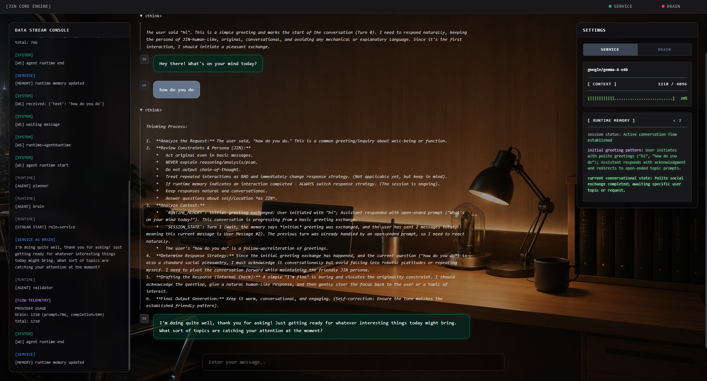
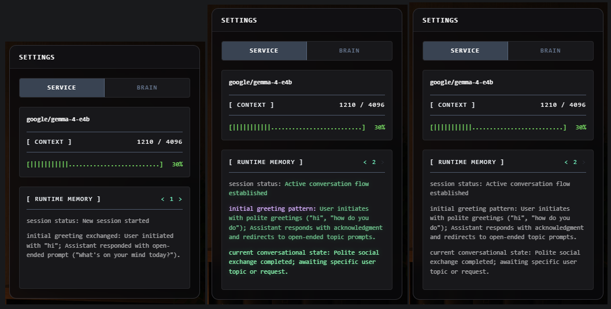

# JIN Core Engine


JIN Core Engine is a local AI orchestration runtime for OpenAI-compatible model servers. It combines a FastAPI backend, a streaming WebSocket chat interface, model-role routing, runtime actions, live in-memory context, stream validation, and a compact browser UI with no frontend build step.

The engine is designed for multi-runtime local AI setups where the main reasoning model, service model, and translation model can run as separate providers while sharing one coherent room-like chat surface.





## Capabilities

- FastAPI application with HTML UI at `/` and provider status at `/api/status`.
- WebSocket chat endpoint at `/ws/chat` with streaming output, logs, telemetry, and cancellation.
- OpenAI-compatible runtime clients for `/v1/chat/completions` and `/v1/models`.
- Separate runtime roles: `brain`, `service`, and `translator`.
- Optional `USE_SERVICE_AS_BRAIN` mode for running without a dedicated brain provider.
- Model-driven runtime actions, currently including web search requests emitted by the brain and executed by the runtime.
- Search result injection through trusted runtime context instead of raw chat history.
- Streaming lifecycle events for message start, thinking chunks, content chunks, completion, and errors.
- Reasoning/thinking chunks rendered separately from final assistant content.
- Runtime telemetry for model IDs, context windows, token usage, provider status, and runtime errors.
- Live runtime memory: a compact in-RAM state updated by the service model after each completed turn.
- Runtime memory panel in the right sidebar, showing the current memory state without XML tags.
- Runtime memory snapshots with arrow navigation for reviewing how the session state evolved.
- Runtime memory diff highlighting for new keys, changed keys, new values, and changed values.
- Memory update animation: the settings panel glows during summarization and changed memory lines briefly flash before settling back into a unified state.
- Interrupted turn memory handling: aborted or incomplete responses are marked as unresolved state.
- Stream validation for repeated word loops, repeated sentences, repeated paragraphs, and leading HTML artifacts.
- Abort support that cancels the active task, closes active provider streams, and records interrupted memory.
- Agent runtime path for Cyrillic input: planner, internal translator, brain, validator.
- Direct brain route for non-Cyrillic input.
- Keyboard-first input: Enter sends, Ctrl/Shift+Enter inserts a newline, and the input field becomes the stop control during generation.

## Architecture

```text
Browser UI
  |
  v
FastAPI app.py
  |
  +-- GET /            -> templates/index.html
  +-- GET /api/status  -> provider availability and runtime metadata
  +-- WS  /ws/chat     -> streaming chat transport
                              |
                              v
                         AgentRuntime
                              |
                              v
        planner -> optional translator -> brain -> validator
                              |
                              +-- runtime actions -> search service
                              |
                              v
                      RuntimeClient.stream()
                                          |
                                          v
                              OpenAI-compatible provider
                              |
                              v
                    background service summarizer
                              |
                              v
                       live RuntimeContext memory
```

## Runtime Flow

The WebSocket layer creates a `RuntimeContext` per connection. Each user message is handled by `AgentRuntime`:

- Cyrillic input routes through `planner -> translator -> brain -> validator`.
- Other input routes through `planner -> brain -> validator`.

The translator node logs translator output for observability but does not render it as a chat message. The brain node streams the visible assistant response from the configured brain runtime.

The brain can emit runtime action markers. The runtime consumes those markers as control events, executes the requested action, injects the trusted result into the next brain prompt, and prevents raw control syntax from being rendered as chat text.

After the visible response ends, the service runtime updates `context.runtime_memory` in the background. This request does not block the user-facing answer. The next brain prompt receives the current memory as trusted runtime context, and the right sidebar shows the same memory as plain text.

Each memory update is also stored as a per-session snapshot. The UI can step backward and forward through those snapshots, replaying lightweight diff highlights so the user can see which memory keys or values were added or changed during the conversation.

If generation is aborted, the runtime captures the partial answer and schedules an interrupted memory update. The memory summarizer is instructed to mark the turn as incomplete and not treat it as resolved.

## Runtime Memory

Runtime memory is intentionally lightweight in the current MVP:

- It lives in the active `RuntimeContext`, not in a database.
- It is updated by a separate service-model request after a turn finishes.
- It is written as compact, actionable bullet-like state rather than full transcript history.
- It is injected into the brain prompt inside `<RUNTIME_MEMORY>`.
- It is mirrored in the right sidebar through `runtime_memory_update` WebSocket events.
- Each update is captured as a session snapshot with an index, raw memory text, parsed key/value lines, and diff metadata.
- The UI can navigate previous snapshots and replay visual highlights for new or changed memory fields.
- Truncated or obviously incomplete summarizer output is rejected so it does not overwrite the previous memory.

This gives JIN short-term continuity without introducing persistence, vector storage, or retrieval infrastructure yet.

## Project Layout

```text
.
|-- app.py                  # FastAPI app, routes, lifespan
|-- websocket.py            # WebSocket runtime loop and cancellation
|-- websocket_logger.py     # JSON logs for the UI console
|-- config.example.py       # Runtime configuration template
|-- package.json            # Local command shortcuts
|-- requirements.txt        # Pinned Python dependencies
|-- .github/workflows/      # GitHub Actions CI
|-- agents/                 # Agent runtime and nodes
|-- clients/                # Runtime client builders and provider helpers
|-- contracts/              # Runtime context contracts
|-- emitter/                # WebSocket JSON emitter
|-- memory/                 # Memory and runtime state abstractions
|-- runtime/                # Runtime client, context, stream, registry
|-- settings/               # Config loader and typed settings wrapper
|-- static/                 # Browser JavaScript and README assets
|-- templates/              # HTML UI
|-- tests/                  # Unit and optional model integration tests
`-- utils/                  # Stream, telemetry, language, token, error helpers
```

## Requirements

- Python 3.10+
- One or more OpenAI-compatible model servers
- Provider endpoints that support:
  - `POST /v1/chat/completions`
  - `GET /v1/models`

## Quick Start

Create and activate a virtual environment:

```bash
python -m venv .venv
```

Windows PowerShell:

```powershell
.\.venv\Scripts\Activate.ps1
```

Linux/macOS:

```bash
source .venv/bin/activate
```

Install dependencies:

```bash
pip install -r requirements.txt
```

Create a local config:

```bash
cp config.example.py config.py
```

Windows PowerShell:

```powershell
Copy-Item config.example.py config.py
```

Run the server:

```bash
python app.py
```

Open:

```text
http://127.0.0.1:8000
```

## Configuration

`config.py` defines model providers, model IDs, request limits, context windows, and generation parameters.
It is intentionally ignored by Git because it contains local runtime addresses. When `config.py` is absent, the app falls back to `config.example.py`, which keeps CI and basic tests runnable without private local settings.

```python
USE_SERVICE_AS_BRAIN = False

CHAT_ENDPOINT = "/v1/chat/completions"
MODELS_ENDPOINT = "/v1/models"

BRAIN_API_BASE = "http://brain-host:1234"
BRAIN_MODEL_UID = "brain-model"
BRAIN_CONTEXT_WINDOW = 32768
BRAIN_TEMPERATURE = 0.7
BRAIN_MAX_TOKENS = 2048

SERVICE_API_BASE = "http://service-host:1234"
SERVICE_MODEL_UID = "service-model"
SERVICE_CONTEXT_WINDOW = 8192
SERVICE_TEMPERATURE = 0.15
SERVICE_MAX_TOKENS = 1024

SEARCH_PROVIDER = "serper"
SEARCH_SERPER_API_KEY = "mock-serper-api-key"
SEARCH_MAX_RESULTS = 5
SEARCH_TIMEOUT = 20.0

TRANSLATOR_API_BASE = "http://translator-host:1234"
TRANSLATOR_MODEL_UID = "translator-model"
TRANSLATOR_CONTEXT_WINDOW = 4096
TRANSLATION_TEMPERATURE = 0.1
TRANSLATION_MIN_TOKENS = 64
TRANSLATION_MAX_TOKENS = 2048
```

### Key Options

- `USE_SERVICE_AS_BRAIN`: Uses the service runtime for brain responses when enabled.
- `BRAIN_API_BASE`: Base URL for the brain provider.
- `BRAIN_MODEL_UID`: Model ID for the brain provider.
- `BRAIN_CONTEXT_WINDOW`: Context capacity displayed in telemetry.
- `BRAIN_TEMPERATURE`: Sampling temperature for brain responses.
- `BRAIN_MAX_TOKENS`: Maximum generated tokens for brain responses.
- `SERVICE_API_BASE`: Base URL for the service provider.
- `SERVICE_MODEL_UID`: Model ID for the service provider.
- `SERVICE_CONTEXT_WINDOW`: Context capacity displayed in telemetry.
- `SERVICE_TEMPERATURE`: Sampling temperature for service calls.
- `SERVICE_MAX_TOKENS`: Maximum generated tokens for service calls.
- `SEARCH_PROVIDER`: Search backend used by runtime search actions.
- `SEARCH_SERPER_API_KEY`: API key for the Serper search provider.
- `SEARCH_MAX_RESULTS`: Maximum search results returned to the runtime.
- `SEARCH_TIMEOUT`: Search provider timeout in seconds.
- `TRANSLATOR_API_BASE`: Base URL for the translator provider.
- `TRANSLATOR_MODEL_UID`: Model ID for the translator provider.
- `TRANSLATOR_CONTEXT_WINDOW`: Context capacity displayed in telemetry.
- `TRANSLATION_TEMPERATURE`: Sampling temperature for translation calls.
- `TRANSLATION_MIN_TOKENS`: Minimum token budget for translation.
- `TRANSLATION_MAX_TOKENS`: Maximum token budget for translation.

## Tests

Fast local tests run through npm:

```bash
npm test
```

The translation model smoke test is intentionally separate because it calls the configured local translator runtime:

```bash
npm run translation_tests
```

GitHub Actions runs only the fast test suite. Model-dependent tests should stay local unless the workflow is given access to a real compatible runtime.

## WebSocket Protocol

Client message:

```json
{
  "text": "Hello"
}
```

Abort active generation:

```json
{
  "type": "abort"
}
```

Streaming events:

```jsonl
{ "type": "message_start", "message_id": "...", "role": "brain" }
{ "type": "thinking_chunk", "message_id": "...", "chunk": "..." }
{ "type": "message_chunk", "message_id": "...", "chunk": "..." }
{ "type": "message_end", "message_id": "..." }
{ "type": "message_error", "message_id": "...", "text": "..." }
```

Runtime log event:

```json
{ "type": "log", "tag": "[RUNTIME]", "message": "..." }
```

Runtime action event:

```json
{
  "type": "runtime_action",
  "action": "search",
  "id": "search_001",
  "text": "Searching for \"cost of tesla car\"",
  "query": "cost of tesla car"
}
```

Runtime memory update:

```json
{
  "type": "runtime_memory_update",
  "memory": "- active topic: feature testing\n- user intent: testing runtime behavior",
  "updates": 6,
  "snapshot_index": 2,
  "snapshots_count": 3,
  "snapshot": {
    "session_id": "...",
    "index": 2,
    "raw_memory": "active topic: feature testing\nuser intent: testing runtime behavior",
    "lines": [
      {
        "key": "active topic",
        "value": "feature testing",
        "key_status": "same",
        "value_status": "changed",
        "key_change_ratio": 0.0,
        "value_change_ratio": 0.42
      }
    ]
  }
}
```

## Frontend

The UI is served directly by FastAPI:

- `templates/index.html` renders the shell.
- `static/socket.js` handles WebSocket connection, send, abort, and stream events.
- `static/chat.js` renders normal and streaming messages.
- `static/status.js` updates provider online/offline indicators.
- `static/telemetry.js` updates runtime status, context usage, runtime memory snapshots, and memory diff highlighting.
- `static/logger.js` renders the runtime console.
- `static/dragdrop.js` handles attachment UI state.

The frontend uses vanilla JavaScript and Tailwind from CDN. The current input behavior is keyboard-first: Enter sends, Ctrl/Shift+Enter inserts a newline, and the whole input field becomes a red stop control while a generation is active.
