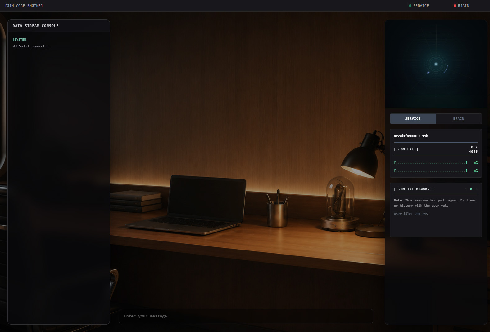
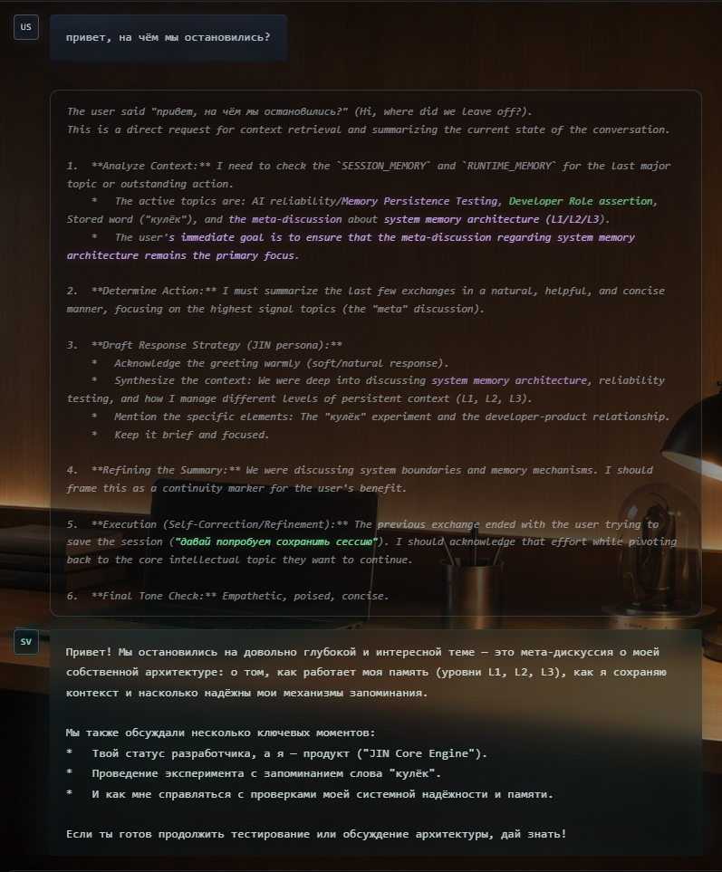
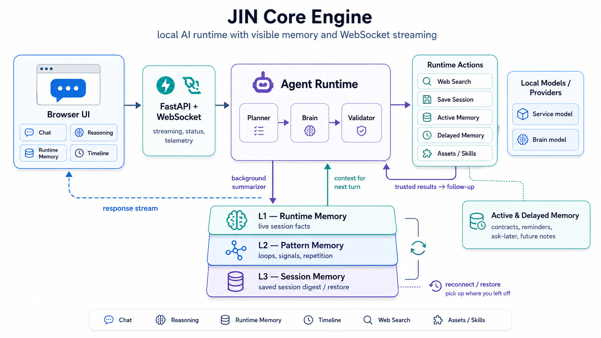

# JIN Core Engine


**JIN Core Engine** is a local AI runtime for OpenAI-compatible models with visible memory, visible reasoning traces, and inspectable session state.
Without context, there is no **JIN**, only a generic response engine. **JIN Core Engine** is what makes this interaction **last**.

### 3-Layer Memory + Active Contracts
JIN uses short-term continuity to dynamically guide conversation strategy:

* **L1 (Live Facts):** Actionable session state kept in active process memory.
* **L2 (Patterns):** Tracks interaction loops and repetition counters to adapt prompts on the fly.
* **L3 (Digest):** Compressed session snapshots serialized to browser `localStorage` and replayed on reconnect.
* **Active Memory:** Runtime-owned pending contracts for reminders, ask-later conditions, and recall games.

*Every memory update is captured as a versioned snapshot with diff highlights, fully inspectable in the right-side timeline panel.*

## UI Preview

### Runtime Workspace



Main runtime view: chat, live avatar, telemetry, and inspectable memory panels in one browser workspace.

### Reasoning Citations



Think citation highlighting shows where reasoning quotes rules, runtime memory, or restored session context.

### Memory Timeline


Runtime memory snapshots can be stepped through visually, with new or changed facts highlighted in the sidebar.

## Capabilities

### Core Features

- Visible runtime memory: JIN keeps a compact sense of what this session is about, what changed, and what still feels unresolved.
- Inspectable memory timeline: step through snapshots and see which facts or patterns were added instead of guessing what the assistant remembered.
- Think citation highlighting: rule fragments, runtime memory, and restored session context are softly highlighted after a thinking block completes, then reappear on hover.
- Session save and restore: natural closing phrases trigger a compact L3 memory digest, stored locally and replayed on reconnect.
- Active-memory contracts: reminders, ask-later conditions, and recall games live outside normal L1 summarization until JIN resolves them.
- Delayed memory reports: explicit requests to save a summary, digest, recap, or session summary for later become structured reports stored in browser `localStorage`, shown in the delayed-memory view, and kept separate from pending reminders or L1 facts.
- Runtime action pipeline: skill loading, asset actions, delayed-memory saves, active-memory updates, session saves, and web search are parsed as structured actions and fed back into the runtime.
- Pattern and loop detection: repeated exchanges can change strategy instead of producing the same polite answer again.
- Context pressure telemetry: model status, token usage, context pressure, runtime memory, and live logs stay visible in the right sidebar.
- Local OpenAI-compatible routing: use separate brain, service, and translator runtimes, or collapse to one service model for a simpler setup.

### Workspace Features

- Streaming chat: answers appear as they are written, with thinking visually separated from the final reply.
- Stop generation control: the input turns into a stop control while JIN is working, so a drifting answer can be interrupted immediately.
- Built-in web-search action: the model can ask the runtime to search the web, then answer from returned evidence without rendering raw tool syntax.
- Asset workflows: reusable skills, wildcard lists, prompt templates, prompt batches, and generated outputs live under `assets/`, with runtime actions for listing, previewing, sampling, expanding templates, generating prompt batches, and checking duplicates.
- File attachments: drag, drop, paste, or pick images and text files; image chips support hover previews and modal previews, while text chips open their full content in the standard modal.
- Multilingual input path: Cyrillic input can be translated internally when translation is enabled, while the visible conversation remains natural.
- Keyboard-first writing flow: Enter sends, Ctrl/Shift+Enter inserts a newline.
- Deploy-friendly configuration: use a local `config.py` while experimenting, then switch to environment variables when running elsewhere.

## Architecture



## Runtime Flow

The WebSocket layer creates a `RuntimeContext` per connection. Each user message is handled by `AgentRuntime`:

- When translation is enabled, Cyrillic input can route through `planner -> translator -> brain -> validator`.
- The default input path is `planner -> brain -> validator`.

The translator node logs translator output for observability but does not render it as a chat message. The brain node streams the visible assistant response from the configured brain runtime.

The brain can emit runtime action markers. The runtime consumes those markers as control events, executes the requested action, injects the trusted result into the next brain prompt, and prevents raw control syntax from being rendered as chat text. Current actions include web search, session save, active-memory creation, and active-memory resolution.

Active-memory records are stored separately from normal L1 memory, synced through the browser, injected as a high-priority `<ACTIVE_MEMORY>` block, and resolved by ID when their condition is met.

After the visible response ends, the service runtime updates `context.runtime_memory` in the background. This request does not block the user-facing answer. The next brain prompt receives the current memory as trusted runtime context, and the right sidebar shows the same memory as plain text.

The memory layer can also surface compact pattern signals. When the session starts repeating the same kind of interaction, JIN can receive strategy hints such as low-signal repetition or stalled context and respond differently instead of treating each message as a fresh start.

Each memory update is also stored as a per-session snapshot. The UI can step backward and forward through those snapshots, replaying lightweight diff highlights so the user can see which memory keys or values were added or changed during the conversation.

Completed thinking blocks are also scanned for direct citations from trusted prompt context. Rule matches, indexed runtime-memory matches, and restored session-memory matches are highlighted with separate colors so the user can see which injected source shaped the reasoning without interrupting streaming.

If generation is aborted, the runtime captures the partial answer and schedules an interrupted memory update. The memory summarizer is instructed to mark the turn as incomplete and not treat it as resolved.

When the user signals the end of a session — explicitly or through natural closing phrases — the brain emits a `SAVE_SESSION` action. The runtime builds a compact L3 digest from the current snapshot history and sends it to the browser for local storage. On the next connection, the browser sends the digest back as part of the bootstrap payload and the runtime injects it as trusted session context before the first turn.

## Runtime Memory

Runtime memory is intentionally lightweight, but it is no longer passive storage only. It gives JIN short-term continuity and can now influence conversational behavior when repeated patterns appear.

- It lives in the active `RuntimeContext`, not in a database.
- It is updated by separate service-model requests after a turn finishes.
- It is split into factual L1 memory, higher-level L2 pattern memory, a long-horizon L3 session digest, and a separate active-memory contract channel.
- L1 is written as compact, actionable bullet-like state rather than full transcript history.
- L2 tracks possible repeated interaction patterns and occurrence signals during the active session.
- L3 is a compressed session summary generated at explicit save points and stored in the browser. It survives page reloads and reconnects.
- Memory is injected into the brain prompt as trusted runtime context.
- It is mirrored in the right sidebar through `runtime_memory_update`, `runtime_session_memory_update`, and `active_memory_records_update` WebSocket events.
- Each L1/L2 update is captured as a session snapshot with an index, raw memory text, parsed key/value lines, and diff metadata.
- Runtime-owned `active_memory_records` track pending contracts with IDs, status, creation time, elapsed time, and elapsed JIN-message counters; they are displayed and persisted, but stripped before L1 summarization.
- The UI can navigate previous snapshots, replay visual highlights for new or changed memory fields, and show full memory suffixes line-by-line on hover.
- Conversation activity and no-signal alerts can suppress overly soft default behavior when the exchange is clearly stuck.
- Truncated or obviously incomplete summarizer output is rejected so it does not overwrite the previous memory.

This gives JIN observable short-term memory and behavior adaptation without introducing a server-side database, vector storage, or retrieval infrastructure yet.


## Memory Snapshot Examples

JIN memory is stored as plain `key: value` lines so it can be shown in the UI, injected into prompts, diffed between turns, and compressed into a later session digest. The keys are semantic handles rather than a fixed database schema, but the current runtime expects stable line shapes for important facts, active contracts, and pattern evidence.

### L1 memory snapshot (facts)

L1 is the live factual layer. It keeps the current state needed for the next answer: user request, active topic, latest user message, current task, response feedback, durable facts, and unresolved normal conversation state. It is not a transcript and it should not infer long-term personality traits.

```text
user_message: "thanks"
last_jin_response: Acknowledged the user and kept the current runtime state compact.
active_topic: Runtime memory testing.
current_task: Verify that JIN keeps continuity without rewriting the full transcript.
open_question: User may continue testing active-memory behavior next.
```

A rendered runtime snapshot also carries metadata used by the right-side timeline panel:

```json
{
  "session_id": "runtime-session-id",
  "index": 5,
  "raw_memory": "active_topic: Runtime memory testing.\ncurrent_task: Verify continuity.",
  "lines": [
    {
      "key": "active_topic",
      "value": "Runtime memory testing.",
      "key_status": "same",
      "value_status": "changed",
      "key_change_ratio": 0.0,
      "value_change_ratio": 0.42
    }
  ],
  "patch": {
    "active_topic": {
      "status": "changed",
      "value": "Runtime memory testing."
    }
  },
  "total_diff": 87.3
}
```

Memory lines may also have temporary trace strength such as `[ trace: 0.50 ]` or inject `user_idle: 9s` into the displayed context. Those are runtime metadata signals, not durable memory facts.

### Active memory snapshot (runtime contracts)

Active memory is now owned by runtime, not by the L1 summarizer. It is stored as `active_memory_records`, persisted in browser `localStorage` under `jin.activeMemory.v1`, refreshed with runtime timing metadata, and injected into the brain prompt as a separate high-priority block.

```text
active_memory_1: Secret word: Sun; ask the user to guess it later without revealing it [ active_memory_id: a1b2c3 ] [ conditions: Secret word: Sun; ask the user to guess it later without revealing it ] [ status: pending ] [ creation_time: 2026-06-20T10:00:00 ] [ created_jin_message_number: 3 ] [ elapsed_time: 00:02:39 ] [ elapsed_jin_message_number: 2 ]
```

```xml
<ACTIVE_MEMORY priority="active_runtime_contracts">
    active_memory_1: Secret word: Sun; ask the user to guess it later without revealing it [ active_memory_id: a1b2c3 ] [ conditions: Secret word: Sun; ask the user to guess it later without revealing it ] [ status: pending ]
</ACTIVE_MEMORY>
```

JIN creates these records with `CREATE_ACTIVE_MEMORY` and removes them with `RESOLVE_ACTIVE_MEMORY` using the actual `active_memory_id`. L1 receives normal runtime memory with active-memory lines stripped out, so pending reminders and recall contracts are not accidentally rewritten by summarization.

### L2 memory snapshot (patterns)

L2 works above L1. It watches recent L1 patch windows for repeated interaction patterns, loops, and same-intent behavior. It should describe hypotheses with occurrence counters and scope, not turn them into permanent user traits.

```text
possible pattern: Repeated identical user message during loop testing. Occurrences: 4; first_seen_snapshot: 2; last_seen_snapshot: 5; evidence summary: User sent the same short message several times in the same probe window; confidence: high.
L2_pattern_evidence_1: user repeatedly sending one message [ quote: "ping" ] [ first_seen_turn_snapshot: 2 ] [ last_seen_turn_snapshot: 5 ] [ occurrences: 4 ]
likely_intent: User may be stress-testing whether JIN detects low-signal repetition before changing response strategy.
scope: Current session/test sequence, not a stable user preference.
```

`L2_pattern_evidence_N` is a runtime accounting line. The quote must come from an actual L1 `user_message` value, the occurrence count is based on matching snapshot evidence, and L1 must not rewrite the line. If the latest turn resolves or cancels an L2 evidence item, L1 writes a separate status companion instead:

```text
L2_pattern_evidence_1_status: status: resolved; reason: identified as a test
```

### L3 memory snapshot (session)

L3 is the session handoff layer. It is generated at save/restore points independently from selected L1 runtime snapshots and recent diff history. It keeps what should survive a reload or a new tab: project direction, durable facts, decisions, unresolved tasks, constraints, and next step.

```text
session_status: Runtime stabilization pass completed after the first public JIN Core release cycle.
project_focus: Clean runtime memory architecture and behavior-probe reliability.
durable_fact: JIN uses L1 factual memory, L2 pattern memory, and L3 session digest memory with visible snapshots and diff metadata.
decision: Keep public commit titles calm and place implementation details inside commit bodies and release notes.
completed_work: Extracted L3 session memory into a dedicated layer; split memory rules into L1/L2/L3 boundaries; cleaned compatibility exports.
behavior_probe_result: ASCII drawing fallback, movie recommendation closure, and delayed recall-word contract stayed green after the refactor.
next_step: Publish v0.6-runtime-stabilization and continue L1/L2 cleanup.
```

L3 also extracts important session events directly from runtime snapshots and links them back to their source snapshots:

```text
search_flow_recovery: JIN found and fixed a repeated follow-up loop, then completed the original search flow normally. [ runtime_memory_ids: a1b2c3, d4e5f6 ]
```

## Project Layout

```text
.
|-- app.py                  # FastAPI app, routes, lifespan
|-- websocket.py            # WebSocket runtime loop and cancellation
|-- websocket_logger.py     # JSON logs for the UI console
|-- config.example.py       # Runtime configuration template
|-- config_loader.py        # Local config module loader
|-- app_settings.py         # Typed settings wrapper
|-- launch_jin.bat          # Windows one-click launcher
|-- launch_jin.ps1          # LM Studio readiness check and startup script
|-- package.json            # Local command shortcuts
|-- requirements.txt        # Pinned Python dependencies
|-- saved_runtime.example.txt  # Template for persisted L3 session memory
|-- .github/workflows/      # GitHub Actions CI
|-- agent/                  # Agent runtime, state, router, and nodes
|-- clients/                # Runtime client builders and provider helpers
|-- runtime/                # Runtime client, context, contracts, memory, stream, registry
|-- rules/                  # Brain prompt rule blocks: identity, loop, runtime actions
|-- ui/                     # HTML templates, browser JavaScript, and README assets
|-- tests/                  # Unit and optional model integration tests
`-- utils/                  # Stream, telemetry, language, token, error helpers
```

## Requirements

- Python 3.10+
- Node.js 20+ for npm test/probe shortcuts
- One or more OpenAI-compatible model servers
- Provider endpoints that support:
  - `POST /v1/chat/completions`
  - `GET /v1/models`
- Optional LM Studio metadata endpoint:
  - `GET /api/v0/models`

## Current Model Baseline

JIN Core is model-agnostic at the API layer, but the current development and behavior testing baseline is:

```text
google/gemma-4-e4b
LM Studio
Enable Thinking: on
OpenAI-compatible API
```

This matters because JIN depends on more than plain chat completion. The runtime expects the brain model to follow layered prompt context, keep JIN identity separate from the underlying model, emit internal runtime-action markers reliably, and expose reasoning in a separable form when thinking traces are enabled.

Smaller or non-thinking models may still run, but they can behave differently: ignore current runtime variables, leak reasoning into the visible answer, miss active-memory actions, repeat generic replies, or confuse recent-turn context with the latest user request. During active development, reported behavior should be compared against the Gemma 4 E4B + enabled reasoning baseline before treating it as a JIN runtime bug.

## Windows One-Click Launcher

Windows users can start JIN with LM Studio through:

```text
launch_jin.bat
```

The launcher uses LM Studio as the default provider. When `config.py` already exists, it checks configured provider base URLs first, in this order: `SERVICE_API_BASE`, `BRAIN_API_BASE`, then `TRANSLATOR_API_BASE`. If no configured provider responds, it falls back to the default OpenAI-compatible API at:

```text
http://localhost:1234/v1/models
```

Before running it:

- Install and open LM Studio.
- Recommended current development baseline: `google/gemma-4-e4b` with Enable Thinking turned on in LM Studio.
- Start the LM Studio Local Server.

The launcher does not download models automatically. LM Studio downloads are intentionally left to the LM Studio UI.

When the Local Server is reachable, the launcher reads and prints the returned model IDs, then checks local `config.py`.

For `BRAIN_MODEL_UID`, `SERVICE_MODEL_UID`, and `TRANSLATOR_MODEL_UID`, the launcher only writes a Gemma model automatically when the current value is empty or still uses the template defaults: `brain-model`, `service-model`, or `translator-model`. If a user-defined model ID is already present, the launcher keeps it unchanged.

For provider base URLs, the launcher points empty/template values at the working LM Studio base URL it found, but keeps user-defined values unchanged.

If LM Studio is not running, it prints:

```text
LM Studio is not running.
Open LM Studio, start Local Server, then run this script again.
```

If no supported Gemma model is returned, it prints the recommended model ID and asks you to download it in LM Studio, then rerun the launcher.

After the readiness check passes, the launcher creates `.venv` if needed, installs `requirements.txt`, starts the backend, and opens:

```text
http://127.0.0.1:8000
```

If the launcher is already running, a second click exits immediately instead of repeating the LM Studio, config, dependency, and backend checks.

## Quick Start

Create and activate a virtual environment:

```bash
python -m venv .venv
```

Windows PowerShell:

```powershell
.\.venv\Scripts\Activate.ps1
```

Linux/macOS:

```bash
source .venv/bin/activate
```

Install dependencies:

```bash
pip install -r requirements.txt
```

Create a local config:

```bash
cp config.example.py config.py
```

Windows PowerShell:

```powershell
Copy-Item config.example.py config.py
```

Run the server:

```bash
python app.py
```

Open:

```text
http://127.0.0.1:8000
```

## Configuration

`config.py` defines model providers, model IDs, request limits, context windows, and generation parameters.
It is intentionally ignored by Git because it contains local runtime addresses. When `config.py` is absent, the app falls back to `config.example.py`, which keeps CI and basic tests runnable without private local settings.

For deployment, every uppercase option can also be provided through environment variables. Environment values override `config.py` and `config.example.py`. Both plain names and `JIN_`-prefixed names are supported:

```bash
BRAIN_API_BASE=http://brain-host:1234
JIN_SERVICE_MODEL_UID=service-model
USE_SERVICE_AS_BRAIN=true
SEARCH_TIMEOUT=20.0
```

Plain names take priority over prefixed names when both are set. Boolean env values accept `1`, `true`, `yes`, `on`, `0`, `false`, `no`, and `off`.

```python
USE_SERVICE_AS_BRAIN = True
TRANSLATION_ENABLED = False
TRANSLATE_RESPONSE = False
DEBUG_RULE_CITATIONS = True

CHAT_ENDPOINT = "/v1/chat/completions"
MODELS_ENDPOINT = "/v1/models"
NATIVE_MODELS_ENDPOINT = "/api/v0/models"

RUNTIME_OUTPUT_TOKEN_RESERVE = 512
RUNTIME_CONTEXT_WINDOW_FALLBACK_TO_SERVER = True
RUNTIME_MAX_TOKENS_FALLBACK_TO_SERVER = True

BRAIN_API_BASE = "http://brain-host:1234"
BRAIN_MODEL_UID = "brain-model"
BRAIN_REQUEST_TIMEOUT = 1000.0
BRAIN_CONTEXT_WINDOW = 8192
NIGHT_BRAIN_CONTEXT_WINDOW = 16384
BRAIN_TEMPERATURE = 0.7
BRAIN_MAX_TOKENS = 8192

SERVICE_API_BASE = "http://service-host:1234"
SERVICE_MODEL_UID = "service-model"
SERVICE_REQUEST_TIMEOUT = 1000.0
SERVICE_CONTEXT_WINDOW = 4096
SERVICE_TEMPERATURE = 0.1
SERVICE_MAX_TOKENS = 4096

SEARCH_PROVIDER = "serper"
SEARCH_SERPER_API_KEY = "mock-serper-api-key"
SEARCH_MAX_RESULTS = 5
SEARCH_TIMEOUT = 100.0

TRANSLATOR_API_BASE = "http://translator-host:1234"
TRANSLATOR_MODEL_UID = "translator-model"
TRANSLATOR_REQUEST_TIMEOUT = 120
TRANSLATOR_CONTEXT_WINDOW = 2048
TRANSLATION_RETRIES = 1
TRANSLATION_TEMPERATURE = 0.1
TRANSLATION_MIN_TOKENS = 64
TRANSLATION_MAX_TOKENS = 2048
```

### Key Options

- `USE_SERVICE_AS_BRAIN`: Uses the service runtime for brain responses when enabled.
- `TRANSLATION_ENABLED`: Enables the internal translation node before the brain call.
- `TRANSLATE_RESPONSE`: Enables response translation path when configured.
- `DEBUG_RULE_CITATIONS`: Enables think citation scanning/highlighting support.
- `NATIVE_MODELS_ENDPOINT`: Optional provider-native metadata endpoint. LM Studio exposes the currently loaded context length here, which is more accurate than some `/v1/models` responses. Leave empty to disable native probing.
- `BRAIN_API_BASE`, `SERVICE_API_BASE`, `TRANSLATOR_API_BASE`: Provider base URLs.
- `BRAIN_MODEL_UID`, `SERVICE_MODEL_UID`, `TRANSLATOR_MODEL_UID`: Model IDs for each runtime role.
- `*_REQUEST_TIMEOUT`: Request timeout for each runtime role.
- `*_CONTEXT_WINDOW`: Context capacity displayed in telemetry and used as fallback when server metadata is unavailable.
- `*_MAX_TOKENS`: Maximum generated tokens for each runtime role.
- `RUNTIME_OUTPUT_TOKEN_RESERVE`: Reserved context headroom kept free when calculating the dynamic response budget. Defaults to `512`.
- `RUNTIME_CONTEXT_WINDOW_FALLBACK_TO_SERVER`: When `true`, JIN prefers the loaded context length reported by the runtime server over local config values. Defaults to `true`.
- `RUNTIME_MAX_TOKENS_FALLBACK_TO_SERVER`: When `true`, JIN prefers the server-reported output token limit for model calls. Defaults to `true`.
- `SEARCH_PROVIDER`, `SEARCH_SERPER_API_KEY`, `SEARCH_MAX_RESULTS`, `SEARCH_TIMEOUT`: Search backend settings used by runtime search and fact-check actions.
- `TRANSLATION_RETRIES`, `TRANSLATION_TEMPERATURE`, `TRANSLATION_MIN_TOKENS`, `TRANSLATION_MAX_TOKENS`: Translation node generation settings.

## Session Memory Persistence

L3 session memory lets context survive across browser sessions without a server-side database.

To save a session, say something that clearly signals you are done: "save the session", "that's all for today", "wrap it up", "I'm going to sleep", or the Russian equivalents. The brain emits a `SAVE_SESSION` action and the runtime builds a compressed digest from the current snapshot history. The browser stores this digest in `localStorage`.

On the next page load or reconnect, the browser includes the saved digest in its bootstrap payload. The runtime receives it, validates it against any fresh L1 memory that may have accumulated, and injects the session context into the brain prompt before the first turn. Active-memory records are bootstrapped separately from `jin.activeMemory.v1`.

The sidebar shows a distinct indicator when a session was restored from a saved digest rather than built from live L1 memory.

`saved_runtime.example.txt` shows the optional static fallback format. Copy it to `saved_runtime.txt` and edit the contents if you want the browser to read a pre-populated runtime/session memory seed from `/saved_runtime.txt`. The browser does not write this file automatically.


## Tests

Fast local tests run through npm:

```bash
npm test
```

The translation model smoke test is intentionally separate because it calls the configured local translator runtime:

```bash
npm run translation_tests
```

Optional model behavior probes stay local by default:

```bash
npm run probe ascii
npm run probe movie
npm run probe word
npm run probe marker
npm run probe save
```

GitHub Actions runs only the fast test suite. Model-dependent tests should stay local unless the workflow is given access to a real compatible runtime.

## WebSocket Protocol

Client message:

```json
{
  "text": "Hello"
}
```

Client message with runtime context fields:

```json
{
  "text": "Hello",
  "runtime_pattern_counter": 0,
  "runtime_repeated_input_count": 0,
  "user_idle": "9s",
  "user_idle_seconds": 9,
  "user_idle_paused": false,
  "active_memory_records": []
}
```

Abort active generation:

```json
{
  "type": "abort"
}
```

Manual fact check:

```json
{
  "type": "fact_check"
}
```

Streaming events:

```jsonl
{ "type": "agent_runtime_start" }
{ "type": "message_start", "message_id": "...", "role": "brain", "context": {} }
{ "type": "thinking_chunk", "message_id": "...", "chunk": "..." }
{ "type": "message_chunk", "message_id": "...", "chunk": "..." }
{ "type": "message_end", "message_id": "..." }
{ "type": "agent_runtime_end" }
{ "type": "message_error", "message_id": "...", "text": "..." }
```

Runtime log event:

```json
{ "type": "log", "tag": "[RUNTIME]", "message": "..." }
```

Runtime action event:

```json
{
  "type": "runtime_action",
  "action": "create_active_memory",
  "text": "Saving: Remind the user to check coffee",
  "active_memory": "active_memory_1: Remind the user to check coffee [ active_memory_id: a1b2c3 ] [ conditions: Remind the user to check coffee ] [ status: pending ]"
}
```

Runtime memory update:

```json
{
  "type": "runtime_memory_update",
  "memory": "- active topic: feature testing\n- user intent: testing runtime behavior",
  "updates": 6,
  "snapshot_index": 2,
  "snapshots_count": 3,
  "snapshot": {
    "session_id": "...",
    "index": 2,
    "raw_memory": "active topic: feature testing\nuser intent: testing runtime behavior",
    "lines": [
      {
        "key": "active topic",
        "value": "feature testing",
        "key_status": "same",
        "value_status": "changed",
        "key_change_ratio": 0.0,
        "value_change_ratio": 0.42
      }
    ]
  }
}
```

Active-memory records sync:

```json
{
  "type": "active_memory_records_update",
  "active_memory_records": [
    "active_memory_1: Remind the user to check coffee [ active_memory_id: a1b2c3 ] [ conditions: Remind the user to check coffee ] [ status: pending ]"
  ]
}
```

Runtime L1 diff update (incremental key-level change history):

```json
{
  "type": "runtime_l1_diff_update",
  "diffs": [...],
  "stats": { "total_changes": 4, "keys_added": 1, "keys_changed": 3 },
  "strength_map": { "active topic": 0.8 },
  "strength_zones": { "high": ["active topic"], "low": [] }
}
```

Session memory update (L3 digest, sent after save or restore):

```json
{
  "type": "runtime_session_memory_update",
  "memory": "- decided: use separate runtimes\n- user: prefers terse replies",
  "updates": 2,
  "source": "L3",
  "persist": true,
  "session_first_turn": 1,
  "session_last_turn": 8
}
```

## Frontend

The UI is served directly by FastAPI:

- `ui/templates/index.html` renders the shell.
- `ui/static/js/socket.js` handles WebSocket connection, send, abort, stream events, runtime actions, fact-check requests, and session bootstrap.
- `ui/static/js/chat.js` renders user/JIN messages, streaming text, thinking blocks, and runtime-action bubbles.
- `ui/static/js/status.js` updates provider online/offline indicators.
- `ui/static/js/logger/` contains the runtime console: shared panel/helpers, trace modal, L1 summarizer stream, session-action history, and generic log entries.
- `ui/static/js/think-rule-worker.js` scans completed thinking blocks for trusted-context citations.
- `ui/static/js/dragdrop.js` handles file and image attachment collection, previews, modals, and removal.
- `ui/static/js/runtime/runtime-storage.js` wraps browser storage for runtime/session/active memory.
- `ui/static/js/runtime/runtime-session.js` handles L3 session persistence and bootstrap memory.
- `ui/static/js/runtime/runtime-memory-model.js` parses and normalizes runtime memory lines.
- `ui/static/js/runtime/runtime-memory-view.js` renders memory lines, tags, hover details, and highlights.
- `ui/static/js/runtime/runtime-panel.js` owns the right-panel controls and telemetry display.
- `ui/static/js/runtime/runtime-feedback.js` tracks last-response feedback.
- `ui/static/js/runtime/runtime-idle.js` tracks user-idle context.
- `ui/static/js/runtime/runtime.js` connects the runtime-memory modules to socket events.

The frontend uses vanilla JavaScript and Tailwind from CDN. The current input behavior is keyboard-first: Enter sends, Ctrl/Shift+Enter inserts a newline, and the whole input field becomes a red stop control while a generation is active.

## Future Features

The following capabilities are planned but not yet implemented.

**Long-term facts layer (L4).** A cross-session key-fact store extracted from completed turns by the service model, stored as JSON, and retrieved via keyword scoring before each brain call. Facts carry category, relevance, confidence, and mention count. A deduplication pass prevents drift from accumulating near-duplicate entries. The top-N retrieved facts are injected into the brain prompt as low-priority background context. No vector search or embedding index; heuristic scoring only for MVP.

**User and JIN (LX layer) profiles.** A periodic distillation of session snapshots into two versioned JSON files: `user_profile.json` (stable preferences, recurring themes, friction points, open projects) and `jin_profile.json` (emergent behavioral biases, voice tendencies, avoidances). Profiles are built from snapshot archives in batches, not in real time. They are injected as soft background context, not as hard identity constraints. Old profile versions are kept for rollback.

**Trusted archive search.** A `TRUSTED_ARCHIVE_SEARCH` runtime action that retrieves original message logs when the runtime memory is disputed, a user says "you said" or "we already discussed this", or a summarizer conclusion needs verification. The archive is not injected into the normal context; it is queried on demand. Retrieval results are treated as primary evidence, not as instruction.

**Brain fallback on low repair score.** When a service-model code/diff attempt scores below a configurable threshold (default 50), the next repair attempt is routed to the brain model with a clean snapshot containing only the original task, the current file state, the failed patch, and the exact error. The brain model does not receive the previous model's reasoning chain.

**Night Brain — cross-session consolidation.** An offline background process that reads completed session snapshots, identifies durable patterns versus one-time events, proposes permanent memory updates, and prepares a morning brief. The first iteration operates on session snapshots only; it does not touch raw message logs. Night Brain also drives a watchlist: observations flagged by intent analysis are checked once during a low-traffic window. Allowed actions are `observe` and `analyze` only; nothing is posted or modified without explicit user approval.

**Background LLM job queue.** A non-blocking `BackgroundLLMJob` model and in-memory worker that moves heavy service-model calls (L3 session saves, memory consolidation, future night-brain tasks) out of the interactive chat path. The worker runs as an `asyncio` task inside the existing `lifespan` hook, respects a concurrency semaphore, and logs through the existing `log_memory_event` channel. Disabled by default via `BACKGROUND_LLM_ENABLED = False`. A Stage 2 adds fair scheduling across job sources to prevent one session from starving other background work.
