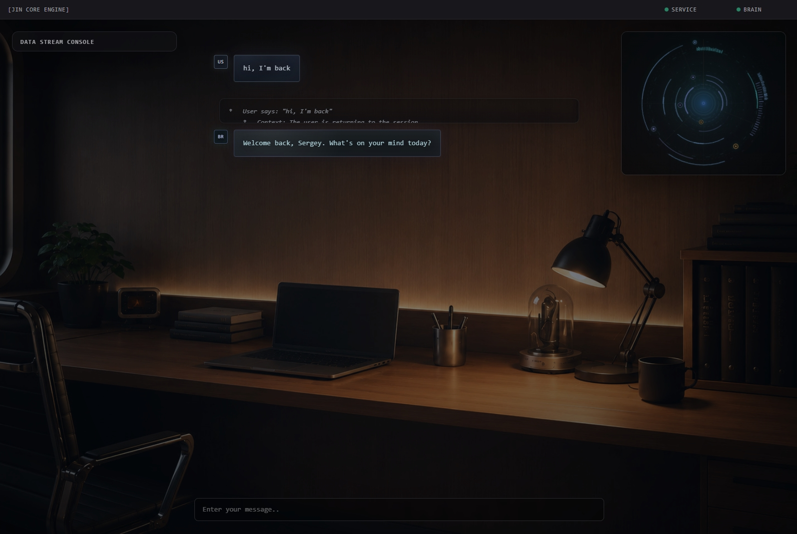
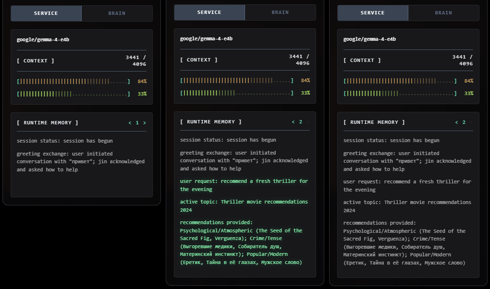
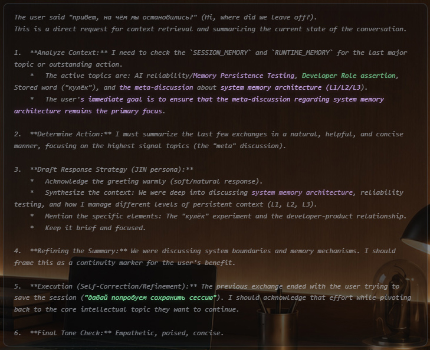
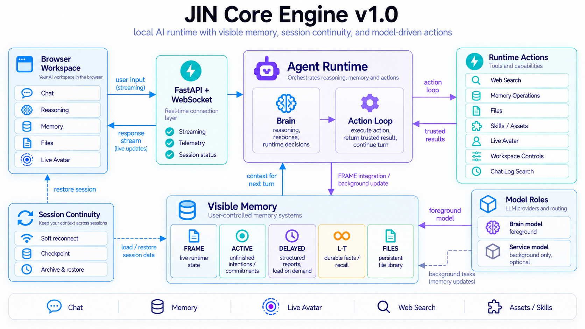

# JIN Core Engine


> *Without context, there is no JIN, only a generic response engine. JIN Core Engine is what makes this interaction last.*

**JIN Core Engine** is an experimental cognitive runtime for OpenAI-compatible models. It is a focused environment built around a single philosophy: **visible, tactile, and continuous memory.**

The interface is intentionally not overloaded with familiar UX elements. Instead of relying on linear chat histories, the runtime maintains a dynamic, layered memory model. During everyday use the side panels can remain collapsed—the system continues to carry the current state. When needed, the memory, reasoning trace, telemetry, and action history remain available for inspection and correction.

## Interface



The JIN interface combines the chat stream, collapsible panels with model telemetry and inspectable memory layers, runtime actions, and live avatar.

### Live Avatar
<table>
<tr>
<td width="66%" valign="top">
<p>Live Avatar turns JIN's memory state into a moving map of cognitive density.</p>
<p>Each L1 field becomes its own inner orbit, with its position shaped by the amount of stored context and its rotation speed driven by interaction flow. The outer rings track L4 facts, Delayed Memory, and Active Memory as individual signals.</p>
<p>When JIN references a rule or memory item, the corresponding orbit lights up, revealing which part of the runtime is actively influencing the current thought.</p>
</td>
<td width="34%" align="center" valign="middle">

</td>
</tr>
</table>

## Memory Architecture

JIN separates memory by cognitive purpose instead of storing everything in one endlessly growing transcript.

### The Four-Layer Memory Model

* **L1 — Live Facts:** The current topic, request, task state, decisions, feedback, and unresolved points needed for the next turn.
* **L2 — Patterns:** Repeated inputs, stalled loops, and short-term interaction patterns that may require a strategy change.
* **L3 — Session Digest:** A compact session handoff containing essential state, completed work, open tasks, and the next step. It can be restored after a reload or reconnect.
* **L4 — Long-Term Facts:** Stable facts, preferences, project decisions, constraints, and environment details that should remain available across sessions.

Every accepted runtime-memory update is stored as a versioned snapshot. The timeline can be stepped through visually, with new and changed fields highlighted.



### Delayed Memory

JIN uses **Delayed Memory** to preserve important context without relying on long conversation histories. Important thoughts, project specifications, or specific discussions are saved as compact, structured objects. The system can autonomously suggest relevant objects or append them directly to the current session. This allows multiple past contexts to be merged into the active thought process only when they are needed.

### Active Memory

**Active Memory** keeps unfinished intentions and pending commitments separate from the general conversation state. Reminders, ask-later conditions, recall rules, and other unresolved contracts remain active across turns and browser tabs until they are fulfilled, cancelled, or explicitly resolved. When a stored condition is met, JIN can bring the memory back into the current interaction without relying on the conversation transcript alone.

### Facts Memory and L4 Consolidation

**Facts Memory** is an inspectable per-session index of durable fields selected from L1. When the workspace is idle, JIN extracts long-term candidates, compares them with the existing L4 store, and merges duplicate or overlapping facts. Delayed Memory reports can absorb selected L4 facts so the same material is not injected twice.

## Core Capabilities

* **Visible Reasoning:** Streams model thinking and the final answer as separate blocks.
* **Reasoning Citations:** Highlights direct references to runtime rules, live memory, and restored session context.
* **Continuous Context:** Keeps the current task, decisions, feedback, and unresolved points available across turns.
* **Persistent Attachments:** Images and text files remain attached as visible chips until manually removed.
* **Runtime Telemetry:** Shows model status, token usage, context pressure, memory updates, and runtime logs.
* **Interruptible Generation:** Stops an active response without discarding the entire session.
* **Action Engine:** Allows the model to request runtime operations during the same workflow.



### Runtime Actions

JIN can request an action while answering. The runtime validates and executes it, then returns any required result to the model before the workflow continues.

Available actions include:

* web search for current information;
* session save and restore;
* Active Memory creation and resolution;
* Delayed Memory save, update, append, and removal from the current context;
* runtime TODO lists for multi-step work;
* asset and skill discovery;
* temporary attachment of local Python skills;
* live avatar and workspace color changes.

## Architecture



### Runtime Flow

The WebSocket layer creates a `RuntimeContext` for each connection. Every user message is then handled by `AgentRuntime`.

A normal turn follows this path:

1. The user sends a message with optional persistent attachments.
2. The planner prepares the request and selects the runtime path.
3. The brain model produces the reasoning stream and visible answer.
4. The validator checks the completed output and runtime markers.
5. Runtime Actions execute when the model needs search, memory, skills, assets, or another internal step.
6. After the visible answer finishes, the service model updates L1 and L2 in the background.
7. The next turn receives current memory, selected reports, active contracts, attached skills, and long-term facts.

The default model path is:

```text
planner -> brain -> validator
```

When translation is enabled, Cyrillic input can be routed through:

```text
planner -> translator -> brain -> validator
```

Translator output is logged for observability but is not rendered as a chat message. The brain streams the visible response from the configured brain runtime.

### Model Roles

JIN is model-agnostic at the API layer. One OpenAI-compatible model can handle all roles, or the work can be split between separate endpoints:

* **Brain:** visible reasoning, responses, and runtime decisions;
* **Service:** background memory updates and supporting work;
* **Translator:** optional internal translation before the brain step.

A thinking-capable model is recommended for the Brain role. Reliable reasoning separation and Runtime Action use depend on the selected model.

### Runtime Storage

JIN does not require a server-side database.

Persistent state is stored locally through:

* browser `localStorage` for session-facing runtime state;
* JSON files under `memory/` for persistent memory objects;
* `saved_runtime.txt` for an optional static L1 session seed.

## Assets and Skills

Reusable material lives under `assets/`:

```text
assets/
|-- skills/       # Instructions and optional local Python tools
|-- prompts/      # Reusable prompt lists
|-- templates/    # Prompt templates
|-- wildcards/    # Text values used by templates and generators
`-- outputs/      # Generated files
```

JIN can inspect available skills, attach the one required for the current task, run its allowed actions, and remove it afterward. Python skills are restricted to `.py` files inside the selected skill directory and run without a shell.

## Project Layout

```text
.
|-- app.py                     # FastAPI app, routes, and lifespan
|-- websocket/                 # WebSocket routing, messages, and UI logging
|-- contracts/                 # Action markers, rules, guards, and follow-ups
|-- agent/                     # Agent runtime, state, router, and nodes
|-- clients/                   # OpenAI-compatible client builders
|-- runtime/                   # Context, memory, streams, telemetry, registry
|-- memory/                    # Persistent memory files and placeholders
|-- rules/                     # Brain and runtime rule blocks
|-- utils/                     # Actions, assets, validation, and storage helpers
|-- ui/                        # Browser interface and README images
|-- tests/                     # Unit, action, and model-integration tests
|-- config.example.py          # Configuration template
|-- config_loader.py           # Local configuration loader
|-- app_settings.py            # Typed settings wrapper
|-- launch_jin.bat             # Windows one-click launcher
|-- launch_jin.ps1             # LM Studio readiness and startup script
|-- requirements.txt           # Python dependencies
|-- package.json               # Test and probe commands
`-- saved_runtime.example.txt  # Optional L3 memory seed
```

## Setup and Quick Start

### Requirements

* Python 3.10+
* One or more OpenAI-compatible model servers
* Node.js 20+ only for local tests and behavior probes
* A Serper API key only when built-in web search is enabled

The model server must expose:

```text
/v1/chat/completions
/v1/models
```

LM Studio may also expose `/api/v0/models`, allowing JIN to read the loaded context length.

### Windows + LM Studio

1. Install LM Studio and load an OpenAI-compatible chat model.
2. Start the LM Studio Local Server.
3. Run:

```cmd
launch_jin.bat
```

The launcher checks the local model server, creates `config.py` from the template when needed, prepares `.venv`, installs dependencies, starts JIN, and opens:

```text
http://127.0.0.1:8000
```

It does not download models automatically or replace provider URLs and model IDs that are already configured.

### Manual Start

```bash
git clone https://github.com/makeitdouble/jin_core.git
cd jin_core
python -m venv .venv
```

Windows PowerShell:

```powershell
.\.venv\Scripts\Activate.ps1
Copy-Item config.example.py config.py
```

Linux/macOS:

```bash
source .venv/bin/activate
cp config.example.py config.py
```

Install and run:

```bash
pip install -r requirements.txt
python app.py
```

Then open:

```text
http://127.0.0.1:8000
```

## Configuration

Copy `config.example.py` to `config.py`, then set the provider URLs and model IDs. `config.py` is ignored by Git.

| Option | Purpose |
| --- | --- |
| `USE_SERVICE_AS_BRAIN` | Use the service model for visible brain responses. |
| `BRAIN_API_BASE`, `BRAIN_MODEL_UID` | Configure the Brain provider and model. |
| `SERVICE_API_BASE`, `SERVICE_MODEL_UID` | Configure the Service provider and model. |
| `TRANSLATION_ENABLED` | Enable the Translator path. |
| `BRAIN_CONTEXT_WINDOW`, `BRAIN_MAX_TOKENS` | Set local context and output fallbacks. |
| `BRAIN_IMAGE_INPUT_ENABLED` | Send image attachments to compatible models. |
| `L4_MEMORY_ENABLED`, `L4_IDLE_SECONDS` | Enable L4 consolidation and set its idle delay. |
| `SEARCH_SERPER_API_KEY`, `SEARCH_MAX_RESULTS` | Configure built-in web search. |
| `BRAIN_MAX_FOLLOWUPS` | Limit internal action and follow-up steps per user turn. |

Every uppercase option can also be supplied through environment variables. Plain names and `JIN_`-prefixed names are supported; plain names take priority.

## Tests

Run the fast local suite:

```bash
npm test
```

Run the translator smoke test against the configured local model:

```bash
npm run translation_tests
```

Run optional behavior probes:

```bash
npm run probe ascii
npm run probe movie
npm run probe word
npm run probe marker
npm run probe save
npm run probe delayed
```

GitHub Actions runs the fast suite. Model-dependent probes remain local unless CI is connected to a compatible runtime.
